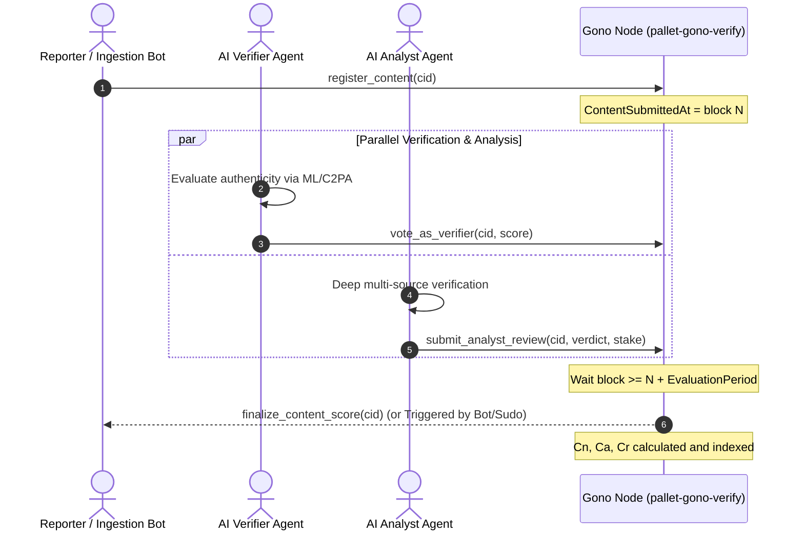

# SANUB Credibility Scoring & Verification Engine (`pallet-gono-verify`)

> **Autonomous & Agentic Implementation Guide for Gono Protocol**  
> Adheres strictly to **Section 8.2 of the Gono Protocol Whitepaper (SANUB Framework: Sharing and Analyzing News Using Blockchain)**.

---

## 1. System Overview

`pallet-gono-verify` provides a mathematically rigorous, deterministic on-chain credibility scoring engine for digital media and news artifacts registered on Gono Protocol.

```
                  ┌───────────────────────────────┐
                  │   Reporter (Account / SDK)    │
                  │   register_content(cid)       │
                  └──────────────┬────────────────┘
                                 │
                 ┌───────────────┴───────────────┐
                 │                               │
                 ▼                               ▼
  ┌─────────────────────────────┐ ┌─────────────────────────────┐
  │      Community / AI         │ │    Professional Analysts    │
  │        Verifiers            │ │       (AI / Humans)         │
  │   vote_as_verifier(cid, p_k)│ │submit_analyst_review(cid,v) │
  └──────────────┬──────────────┘ └──────────────┬──────────────┘
                 │                               │
                 └───────────────┬───────────────┘
                                 │
                                 ▼
                  ┌───────────────────────────────┐
                  │    finalize_content_score     │
                  │  Deterministic FixedU128 Math │
                  │  B_n, I_n, S(B_n), C_a, Cr, Cn│
                  └───────────────────────────────┘
```

---

## 2. Participant Roles

| Role | Responsibility | Input Data | On-Chain Function |
|---|---|---|---|
| **Reporter** | Publishes and indexes content hash / CID. | `cid: BoundedVec<u8, MaxCidLength>` | `register_content(cid)` |
| **Verifier** | Community members or AI oracles giving binary consensus. | `p_k \in {0, 1}` (0 = Fake/Reject, 1 = Authentic/Approve) | `vote_as_verifier(cid, score_binary)` |
| **Analyst** | Domain experts or AI fact-checking agents submitting verdicts with economic stake. | `verdict: Verdict (Approve/Reject)`, `stake: u128` | `submit_analyst_review(cid, verdict, stake)` |

---

## 3. Mathematical Foundations (`sp_runtime::FixedU128`)

All arithmetic is executed in `no_std` using Substrate's 18-decimal fixed-point scalar `FixedU128`.

### 3.1 Public Belief (Equation 2)
$$B_n = \frac{1}{N_n} \sum_{k=1}^{N_n} p_k$$
- $N_n$: Total verifier votes on content $n$.
- Range: $B_n \in [0.0, 1.0]$.
- Implementation: `calculate_public_belief(approvals, total_verifiers)`.

### 3.2 Content Importance (Equation 3)
$$I_n = \frac{N_n}{N_T}$$
- $N_T = \max(\text{TotalActiveVerifiers}, \text{MinVerifiers})$: Total network active verifiers with safety floor.
- Range: $I_n \in [0.0, 1.0]$.
- Implementation: `calculate_content_importance(total_verifiers, total_active_verifiers)`.

### 3.3 Belief Sigmoid Function (Equation 4)
$$S(B_n) = \frac{e^{B_n - 0.75}}{e^{B_n - 0.75} + 1}$$
- Center offset: $0.75$ (requires strong consensus $> 75\%$ to push score past 0.5).
- Evaluated via 12th-order Taylor series of $e^x$ for $x \ge 0$, and symmetry identity $S(B_n) = \frac{1}{1 + e^{0.75 - B_n}}$ for $B_n < 0.75$.
- Range: $S(0.0) \approx 0.32082$, $S(0.75) = 0.5$, $S(1.0) \approx 0.56218$.

### 3.4 Analyst Positive Credit $T_p$ (Equation 5)
$$T_p = \sum_{i=1}^{a_p} S(B_{n_i}) + \sum_{j=1}^{a_n} S(1 - B_{n_j})$$
- Approving analysts earn reward $S(B_n)$.
- Rejecting analysts earn reward $S(1 - B_n)$.

### 3.5 Analyst Credit with Asymmetric Punishment (Equation 6)
$$C_a = \frac{T_p}{T_p + (a_t - T_p) \cdot \left(2 + \frac{1}{a_t}\right)}$$
- $a_t = a_p + a_n$: Total analyses conducted by analyst.
- Penalty factor: $\left(2 + \frac{1}{a_t}\right) \ge 2.0$. Heavily penalizes false analyses compared to correct analyses.
- Bounded: $C_a \in [0.0, 1.0]$.

### 3.6 Reporter Credit $C_r$ (Equation 7)
$$\text{Contrib}_i = \left( \frac{\sum_{j=1}^{a_p} C_{a_j}}{\sum_{j=1}^{a_p} C_{a_j} + \sum_{k=1}^{a_n} C_{a_k} \cdot \left(2 + \frac{1}{a_{ti}}\right)} \right) \cdot I_{n_i}$$
$$C_r = \frac{1}{n_{rt}} \sum_{i=1}^{n_{rt}} \text{Contrib}_i$$
- Weighted sum of analyst endorsements scaled by content importance $I_n$.
- Averaged over $n_{rt}$ published contents.

### 3.7 Content Credibility Score $C_n$ (Equation 8)
$$C_n = \left( \frac{\sum C_{a_{approved}}}{\sum C_{a_{approved}} + \sum C_{a_{rejected}}} \right) \cdot C_r$$
- Combines analyst consensus ratio with reporter's historical reputation $C_r$.

---

## 4. Storage Architecture

| Storage Item | Type | Key | Value | Description |
|---|---|---|---|---|
| `VerifierScores` | `StorageDoubleMap` | `(Cid, AccountId)` | `u8` | Binary vote ($p_k \in \{0, 1\}$) |
| `AnalystReviews` | `StorageDoubleMap` | `(Cid, AccountId)` | `AnalystReview` | Verdict + numerical stake |
| `AnalystCredit` | `StorageMap` | `AccountId` | `FixedU128` | Reputation score $C_a$ |
| `ReporterCredit` | `StorageMap` | `AccountId` | `FixedU128` | Reputation score $C_r$ |
| `ContentCredibility`| `StorageMap` | `Cid` | `FixedU128` | Final credibility score $C_n$ |
| `VerifierCount` | `StorageMap` | `Cid` | `u32` | Total verifier count $N_n$ |
| `VerifierApprovals`| `StorageMap` | `Cid` | `u32` | Count of approving verifiers |
| `TotalActiveVerifiers`| `StorageValue` | — | `u32` | Global unique verifier count $N_T$ |
| `HasVotedBefore` | `StorageMap` | `AccountId` | `bool` | Flag tracking unique voters for $N_T$ |
| `ContentReporter` | `StorageMap` | `Cid` | `AccountId` | Content author |
| `ContentSubmittedAt`| `StorageMap` | `Cid` | `BlockNumber` | Registration block number |
| `ContentFinalized` | `StorageMap` | `Cid` | `bool` | Finalization guard flag |

---

## 5. Dispatchables & Extrinsics

### `register_content(origin, cid)`
- **Caller**: Reporter (Signed account).
- **Checks**:
  - Validated by `T::ContentInspector::content_exists(&cid)`.
  - Not already registered.
- **Events**: `ContentRegistered { cid, reporter }`.

### `vote_as_verifier(origin, cid, score_binary)`
- **Caller**: Verifier (Signed account).
- **Checks**:
  - `score_binary <= 1` (0 or 1 only).
  - Content must be registered and not finalized.
  - One vote per account per CID.
- **Events**: `VerifierVoted { cid, who, score }`.

### `submit_analyst_review(origin, cid, verdict, stake)`
- **Caller**: Analyst (Signed account).
- **Checks**:
  - `stake > 0`.
  - Content must be registered and not finalized.
  - One review per account per CID.
- **Events**: `AnalystReviewSubmitted { cid, who, verdict, stake }`.

### `finalize_content_score(origin, cid)`
- **Caller**: Permissionless if `now >= submitted_at + EvaluationPeriod`, or Root/Sudo at any time.
- **Checks**:
  - `VerifierCount >= MinVerifiers`.
  - Not already finalized.
- **Computations**: Evaluates Equations 2–8, updates `AnalystCredit`, `ReporterCredit`, and `ContentCredibility`.
- **Events**: `AnalystCreditUpdated`, `ReporterCreditUpdated`, `ContentFinalized`.

---

## 6. AI Agent Integration & Off-Chain Automation

AI agents acting as autonomous participants should follow this interaction loop:



### 6.1 Inspecting Stored Scores via RPC / Subxt
To query a content's credibility score $C_n$:
```rust
// FixedU128 raw value has 18 decimal places
let raw_score = api.storage().fetch(&gono_verify::storage().content_credibility(&cid), None).await?;
let human_score = (raw_score as f64) / 1_000_000_000_000_000_000.0;
```

---

## 7. Quality Assurance & Test Coverage

All formulas and lifecycle paths are verified with mock runtime tests in [`src/tests.rs`](file:///e:/Meheraj/Blockchain/OlympiadThings/gono-protocol-website/pallets/verify/src/tests.rs):

```bash
# Run verify pallet tests
cargo test -p pallet-gono-verify

# Run full workspace test suite
cargo test --workspace
```
